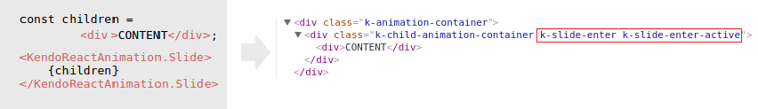
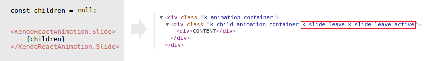
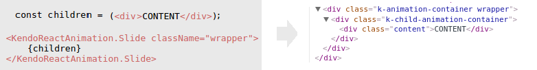
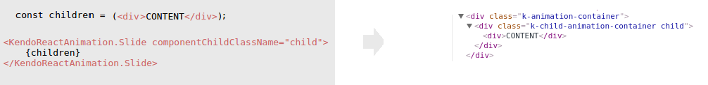

# Fundamentals

This article explains the way Kendo UI Animation components work and how to animate and decorate components. 

## Getting Started 

### Overview

The Kendo UI Animation components are based on the [ReactTransitionGroup](https://facebook.github.io/react/docs/animation.html) add-on component and are an easy way to perform CSS transitions and animations when a React component enters or leaves the DOM. The Expand component is an exception from that rule and does not use CSS transition classes&mdash;it animates the `height` style property.

The Animation is a simple element that wraps all components that are to be animated. Every child element is enclosed in an `AnimationChild` component. It implements the required [special life-cycle hooks](https://facebook.github.io/react/docs/animation.html#low-level-api-reacttransitiongroup) called by `ReactTransitionGroup`. As a result, every child component is wrapped in an additional `div` element. 

> The CSS transition classes are set to the `div` element that wraps the child component.

### Default Setup

The example below demonstrates the default setup of a Kendo UI Animation component for React.

```html
  <style>
  .content {
    width: 100px;
    padding: 10px;
    color: #787878;
    background-color: #fcf7f8;
    font-size: 13px;
    font-family: Helvetica, Arial, sans-serif;
    letter-spacing: 1px;
    text-align: center;
    border: 1px solid rgba(0,0,0,.05);
  }
  </style>
  <div id="app"></div>
```
```jsx
class App extends React.Component {
    constructor(props) {
        super(props);

        this.state = { show: true };
    }

    onClick = () => {
        this.setState({
            show: !this.state.show
        });
    }

    render() {
        const { show } = this.state;

        const children = show ? (<div className="content">CONTENT</div>) : null;

        return (
            <div>
                <dl>
                    <dt>
                        Slide:
                    </dt>
                    <dd>
                        <button onClick={this.onClick}>Animate</button>
                    </dd>
                </dl>

                <KendoReactAnimation.Slide>
                    {children}
                </KendoReactAnimation.Slide>
            </div>
        );
    }
}

ReactDOM.render(
    <App />,
    document.getElementById('app')
);
```

In the case above, the `CONTENT` element is animated with an entering effect when added to the Slide component. When the `CONTENT` is removed, it is animated with a leaving effect.

### Animation of Entering Components

The Animation component sets a `{name}-enter` CSS class to the entering animation child. In the next tick, it adds a `{name}-enter-active` CSS class to start the animation. The naming convention for the CSS class names is inherited from the `ReactTransitionGroup` component.

For example, the Slide component adds a `k-slide-enter` CSS class on enter and, in the next tick, adds a `k-slide-enter-active` to activate the transition.



### Animation of Leaving Components

The Animation component sets a `{name}-leave` CSS class to the leaving animation child. In the next tick, it adds a `{name}-leave-active` CSS class to start the animation. The naming convention for the CSS class names is inherited from the `ReactTransitionGroup` component.

For example, the Slide component adds a `k-slide-leave` CSS class on leave and, in the next tick, adds a `k-slide-leave-active` to activate the transition.

> Leaving components are present in the DOM until the animation finishes.



## Styling the Appearance

Custom CSS classes can be set to the Animation component and/or to its children components.

### Decorate the Parent

To set a custom CSS class to the element that wraps all animated components, use the `className` property.

> The Animation component renders a default `k-animation-container` CSS class that can also be used for styling.



### Decorate the Child

To set a custom CSS class to the element that wraps the animated children, use the `componentChildClassName` property.

> The child component renders a default `k-child-animation-container` CSS class that can also be used for styling.



## Differences from ReactCSSTransitionGroup

The Animation component will stop the active animation before a new one is started, while the `ReactCSSTransitionGroup` will leave the old animation until it finishes.

## Suggested Links

Articles on the Kendo UI Animation components for React:

* [Get Started with the Fade Component]()
* [API Reference of the Fade Component]()
* [Get Started with the Expand Component]()
* [API Reference of the Expand Component]()
* [Get Started with the Slide Component]()
* [API Reference of the Slide Component]()
